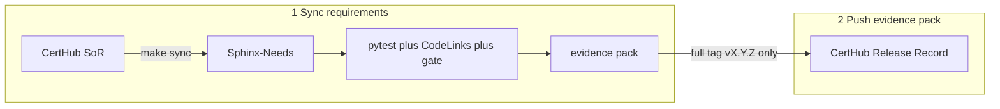

[](https://github.com/CertHubCode/certhub-useblocks-example/actions/workflows/cadence-evidence.yml)
[](https://github.com/CertHubCode/certhub-useblocks-example/actions/workflows/cadence-unit-tests.yml)
[](LICENSE)

# Cadence — CertHub SaMD Engineering Loop

## The product — Sterilisator 20A

This repository is the engineering twin of a fictional **tabletop steam
sterilizer** for small clinics. Staff load reusable instruments, close the
chamber door, and start a cycle. The software under test
(`src/sterilisator_20a/`) evaluates whether the chamber reached **121°C ± 2°C**,
whether the cycle finished within **60 minutes**, keeps the **door locked** while
the cycle is running, and shows **English** status (idle, running, complete,
fault).

Controlled requirements live in CertHub. **Cadence is the loop; Sterilisator 20A
is what the loop is about.**

## Device vs harness

This repo is two layers in one tree:

| Layer | What it is | Where |
|---|---|---|
| **Device** | Sterilisator 20A — the SaMD you would ship (cycle, door lock, English UI) | `src/sterilisator_20a/` (including its unit tests) |
| **Harness** | Cadence — wraps the product so you can sync requirements, gate PRs, and write a Release Record | `certhub/`, `sphinx/`, root `tests/`, `.github/workflows/` |

Layout detail: [docs/architecture.md](docs/architecture.md).

## What the harness does

The harness shows **both** patterns companies use when software engineering sits
outside CertHub. You can adopt either or both.

| | What | When CertHub is written |
|---|---|---|
| **1. Sync / link requirements** | Pull the V-model into Sphinx-Needs, tag design output / verification on source and tests, build an evidence pack | Never — PRs and `make show` stay read-only |
| **2. Push the evidence pack** | On a full `vX.Y.Z` tag, POST one **Release Record** (commit, gate result, evidence URL) | **Yes** — controlled write-back |

Most teams need **pushing evidence** more: a green PR artifact is engineering
proof, not a regulatory record. The Release Record is the controlled row.
Cadence demonstrates the full loop so you can see both ends in one repo.



Open-source useblocks (Sphinx-Needs / CodeLinks / Test-Reports) builds the pack
from real Git work. Commercial useblocks products (ubCode, ubTrace) are optional
— same files, no migration. See [docs/ubcode.md](docs/ubcode.md).

[](https://www.youtube.com/watch?v=9R5RELvVyeY)

## Prerequisites

- Python 3.12+
- [uv](https://docs.astral.sh/uv/)
- A CertHub API key (`CERTHUB_API_KEY`) for `make sync` — [create one in Settings → API Keys](https://docs.certhub.de/api/getting-started)
- Optional: PlantUML on PATH (or `make ensure-plantuml`) for needflow graphs

## Quickstart — feel linking

```bash
git clone https://github.com/CertHubCode/certhub-useblocks-example.git
cd certhub-useblocks-example
make install
cp .env.example .env          # set CERTHUB_API_KEY (see https://docs.certhub.de/api/getting-started)
make sync                     # CertHub → Sphinx-Needs
make show                     # tests + CodeLinks + gate + open dashboard
```

Expect **VERIFIED** and all four `SYSREQ_*` PASS. Then see the gate fail:

```bash
make break && make show       # RED — VERIF_002 cycle time
make fix && make show         # back to GREEN
```

Committed [`certhub.toml`](certhub.toml) is the **showcase tenant**. To point at
your own product, copy [`certhub.toml.example`](certhub.toml.example) and follow
[docs/onboarding.md](docs/onboarding.md).

## Pushing evidence — the write-back

PRs and RC tags upload an evidence artifact only. A full release tag closes the
loop:

```bash
make tag-release VERSION=1.0.0   # v1.0.0 → evidence artifact + CertHub Release Record
```

Or rehearse without tagging: `make confirm BASELINE=0.0.99` (needs an [API key](https://docs.certhub.de/api/getting-started)).
Step-by-step: [docs/walkthrough.md](docs/walkthrough.md) §§6–8.

| Workflow | When | CertHub write? |
|----------|------|----------------|
| `cadence-unit-tests.yml` | Every PR / push | No — fork-safe |
| `cadence-evidence.yml` | PR / main | No — uploads `evidence/` (`CERTHUB_API_KEY` required) |
| `cadence-release.yml` | Tag `v*.*.*` | **Yes**, on full `vX.Y.Z` only (not RC) |

**Repository setup:** GitHub → Settings → Secrets → Actions → `CERTHUB_API_KEY`.

## What to mark in code

Two jobs, not one annotation scheme. CertHub holds the design-control matrix.
This repo tags only the last hop: **design output** on implementation,
**verification** on tests. `DOUT_018` is the CertHub Name prefix
(`DOUT_018 — …`), not “first design output in this repo”.

```text
SYSREQ ←Tracer→ DOUT_018  →  # @need-ids: DOUT_018 on source
SYSREQ ←Tracer→ VERIF_00N →  # @need-ids: VERIF_00N + pytest.mark.certhub_test
```

| SYSREQ | Code (tagged `DOUT_018`) | Test (tagged `VERIF_*`) |
|--------|--------------------------|-------------------------|
| SYSREQ_001 temperature | `src/sterilisator_20a/cycle/controller.py` | VERIF_001 |
| SYSREQ_002 cycle time | `src/sterilisator_20a/cycle/controller.py` | VERIF_002 |
| SYSREQ_003 door interlock | `src/sterilisator_20a/safety/door.py` | VERIF_003 |
| SYSREQ_004 English UI | `src/sterilisator_20a/ui/messages.py` | VERIF_004 |

Showcase shape: **2 user needs → 4 system specs → 3 components → 5 unit specs →
1 design output; 4 verifications + 2 validations**. One product design output
(`DOUT_018`) covers all four SYSREQs. VALID is manual and does not close the
gate. Full citations: [docs/traceability-map.md](docs/traceability-map.md).

After `make show`:


## Docs

| Start here | Then |
|------------|------|
| This Quickstart | [docs/walkthrough.md](docs/walkthrough.md) — GREEN → RED → push |
| Why these markers | [docs/traceability-map.md](docs/traceability-map.md) |
| Your own tenant | [docs/onboarding.md](docs/onboarding.md) |
| Data flow (both directions) | [docs/architecture.md](docs/architecture.md) |
| Stuck | [docs/troubleshooting.md](docs/troubleshooting.md) |
| Optional IDE | [docs/ubcode.md](docs/ubcode.md) |
| Contributing / security | [CONTRIBUTING.md](CONTRIBUTING.md) · [SECURITY.md](SECURITY.md) |

Customer-facing CertHub guides (replace the stack, keep the export / write-back
pattern): [Working example](https://docs.certhub.de/api/overview/working-example) ·
[V-model outside CertHub](https://docs.certhub.de/1.5%20Implementation%20Guides/v-model-software-outside-certhub) ·
[Export Records](https://docs.certhub.de/api/export-records) ·
[Write Evidence Records](https://docs.certhub.de/api/write-evidence-records).

## Commands

```bash
cp .env.example .env   # set CERTHUB_API_KEY — https://docs.certhub.de/api/getting-started

make test                 # connector + SaMD tests (no API key)
make sync                 # CertHub → Sphinx-Needs
make show                 # tests + CodeLinks + verify + open dashboard
make evidence             # same gate, writes evidence/ (CI-friendly)

make tag-rc VERSION=1.0.0 RC=1       # RC tag → CI evidence artifact only
make tag-release VERSION=1.0.0       # full tag → artifact + CertHub Release Record

make push-evidence BASELINE=1.0.0          # dry-run RecordCreate JSON
CERTHUB_PUSH=1 make push-evidence BASELINE=1.0.0   # live POST
make confirm BASELINE=0.0.99               # POST → GET proof

make break && make show   # RED — VERIF_002
make fix && make show     # back to GREEN
```

`make sync` requires [`CERTHUB_API_KEY`](https://docs.certhub.de/api/getting-started).
Layout, inbound sync details, and Release Record field mapping:
[docs/architecture.md](docs/architecture.md). Regenerating OpenAPI clients
(`make generate-api`) is maintainer-only — see [CONTRIBUTING.md](CONTRIBUTING.md).
