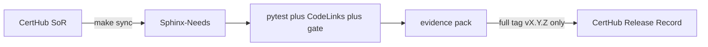
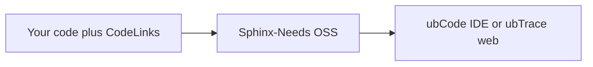
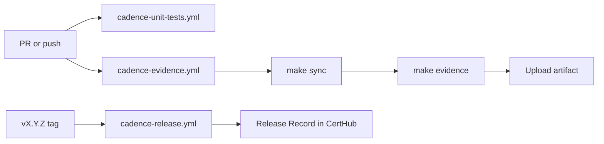
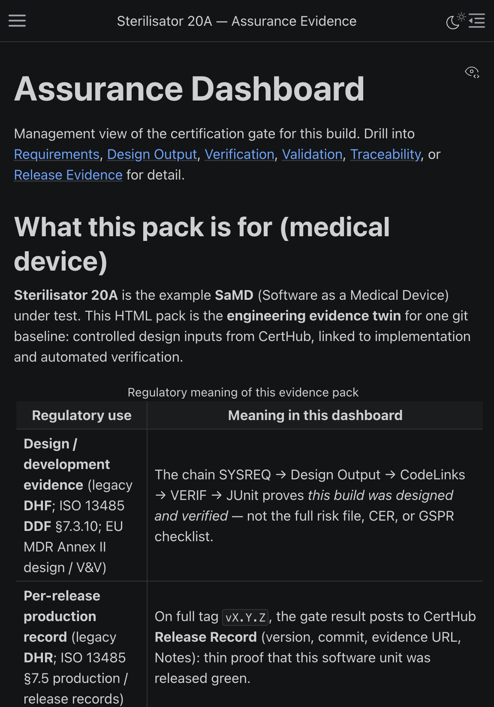
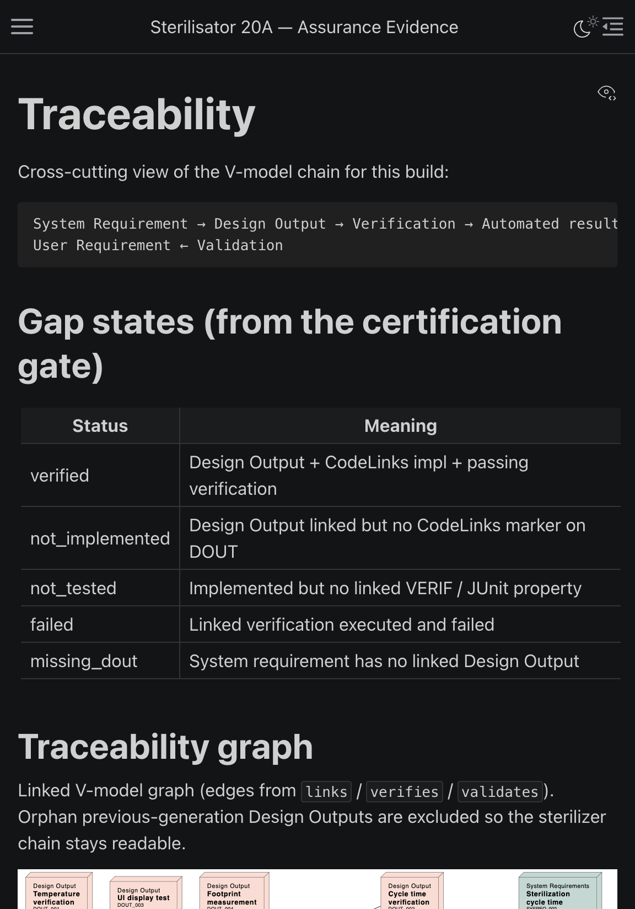
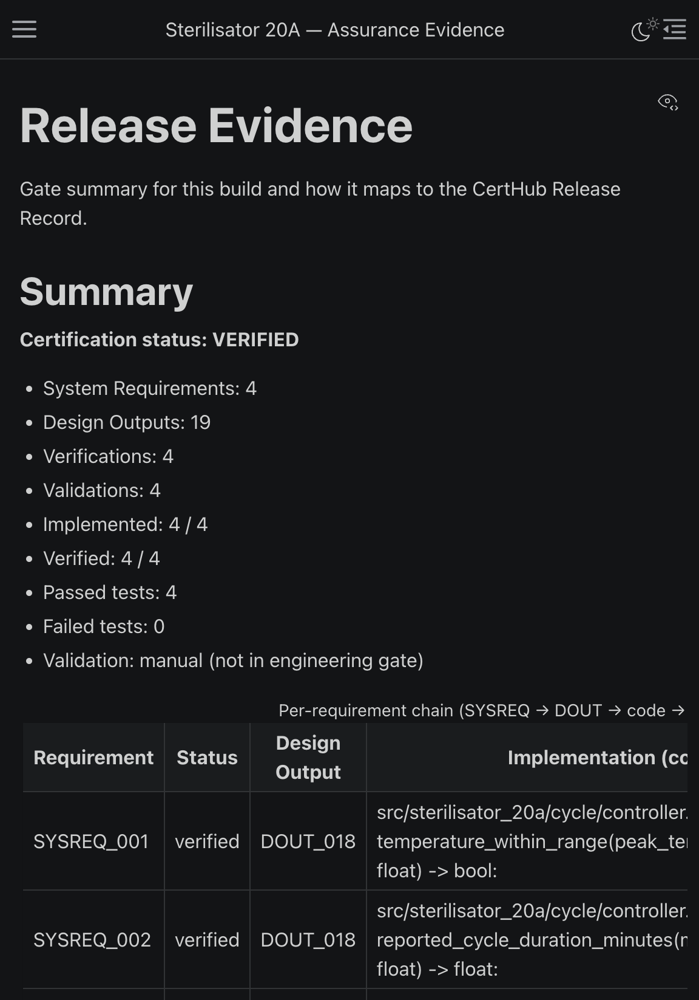

[](https://github.com/CertHubCode/certhub-useblocks-example/actions/workflows/cadence-evidence.yml)
[](https://github.com/CertHubCode/certhub-useblocks-example/actions/workflows/cadence-unit-tests.yml)
[](LICENSE)

# Cadence — CertHub SaMD Engineering Loop

Cadence is CertHub’s public example of an **engineering evidence loop**:
controlled requirements stay in CertHub; this repo syncs them into Sphinx-Needs;
open-source useblocks (Sphinx-Needs / CodeLinks / Test-Reports) builds an
evidence pack from real Git work on the fictional **Sterilisator 20A** SaMD.
Commercial useblocks products (ubCode, ubTrace) are optional — same files, no
migration.



## Prerequisites

- Python 3.12+
- [uv](https://docs.astral.sh/uv/)
- A CertHub API key (`CERTHUB_API_KEY`) for `make sync` — [create one in Settings → API Keys](https://docs.certhub.de/api/getting-started)
- Optional: PlantUML on PATH (or `make ensure-plantuml`) for needflow graphs
- Optional: CodeLinks CLI — `scripts/run_codelinks.py` falls back to `@need-ids:` grep

## Quickstart

```bash
git clone https://github.com/CertHubCode/certhub-useblocks-example.git
cd certhub-useblocks-example
make install
cp .env.example .env          # set CERTHUB_API_KEY (see https://docs.certhub.de/api/getting-started)
make sync                     # CertHub → Sphinx-Needs
make show                     # tests + CodeLinks + gate + open dashboard
```

Expect **VERIFIED** and all four `SYSREQ_*` PASS. Then see the gate fail:

```bash
make break && make show       # RED — VERIF_002 cycle time
make fix && make show         # back to GREEN
```

Committed [`certhub.toml`](certhub.toml) is the **showcase tenant**. To point at
your own product, copy [`certhub.toml.example`](certhub.toml.example) and follow
[docs/onboarding.md](docs/onboarding.md).

## useblocks in your code

This pattern is portable — Cadence is one reference, not a prescribed toolchain.
See [Working example](https://docs.certhub.de/api/overview/working-example).

Integrations live **in the repo**: Sphinx-Needs objects in RST, CodeLinks
comments in product/test code (`# @need-ids:`), Test-Reports from JUnit. No
commercial license is required to clone, sync, and `make show`.

Adopt more of the open-source stack when you want it (filters, needflow, extra
need types, more CodeLinks projects). Same files, same Sphinx build.

When you want an IDE or a live web model, plug in
[ubCode](https://ubcode.useblocks.com/) and/or
[ubTrace](https://ubtrace.useblocks.com/latest/) — they read the same
Sphinx-Needs / `ubproject.toml` / CodeLinks data. You do not migrate the
markers or the evidence loop.



| Layer | What | License |
|-------|------|---------|
| In-repo | Sphinx-Needs, CodeLinks, Test-Reports | Open source (MIT) |
| Optional IDE | [ubCode](https://ubcode.useblocks.com/) (VS Code + `ubc` CLI) | Free for public OSS; paid for private |
| Optional web | [ubTrace](https://ubtrace.useblocks.com/latest/) | Paid — not wired in this example |

## CI and release



| Workflow | When | CertHub write? |
|----------|------|----------------|
| `cadence-unit-tests.yml` | Every PR / push | No — connector + SaMD tests, no API key (fork-safe) |
| `cadence-evidence.yml` | PR / main | No — uploads `evidence/` artifact (`CERTHUB_API_KEY` secret required) |
| `cadence-release.yml` | Tag `v*.*.*` | **Yes**, on full `vX.Y.Z` only (not RC) |

**Repository setup:** GitHub → Settings → Secrets → Actions → `CERTHUB_API_KEY`.
Forks do not inherit that secret; offline tests still run. Details:
[docs/onboarding.md](docs/onboarding.md).

## Traceability model

```text
SYSREQ → DOUT (product: DOUT_018) → @need-ids: on source → VERIF → pytest / JUnit
```

| SYSREQ | Code | Test |
|--------|------|------|
| SYSREQ_001 temperature | `src/sterilisator_20a/cycle/controller.py` | VERIF_001 |
| SYSREQ_002 cycle time | `src/sterilisator_20a/cycle/controller.py` | VERIF_002 |
| SYSREQ_003 English UI | `src/sterilisator_20a/ui/messages.py` | VERIF_003 |
| SYSREQ_004 footprint | `src/sterilisator_20a/enclosure/footprint.py` | VERIF_004 |

Full table and showcase limitations: [docs/traceability-map.md](docs/traceability-map.md).

After `make show`, open `sphinx/build/html/dashboard.html` and
`traceability.html`:







## Showcase limitations

- **One product design output.** Source markers use `DOUT_018`. Procedure DOUTs
  in CertHub are filtered out of the Sphinx needflow graph.
- **VALID is manual.** Validation protocols sync into the pack but do not close
  the engineering gate.

## Boundary

| Layer | Where | When |
|-------|--------|------|
| Engineering proof | `evidence/` + GitHub Actions artifacts | Every PR / main / RC run |
| Regulatory record | CertHub **Release Record** KT (`release_record_kt_id`) | Full release tag `vX.Y.Z` only |

`make show` / `make evidence` never write to CertHub. Only `push-evidence --push`
(or the release workflow) POSTs one Release Record row.

## Customer-facing guides

This repository is **not** a prescribed toolchain. You talk to CertHub through
the API; how you implement the bottom of the V is your choice. Cadence is one
reference implementation — replace the engineering stack with your own and keep
the same export / write-back pattern.

- [Working example](https://docs.certhub.de/api/overview/working-example) — annotated V, your choices vs this example
- [Where does the V-model live when you develop software?](https://docs.certhub.de/1.5%20Implementation%20Guides/v-model-software-outside-certhub)
- [Export Records from CertHub](https://docs.certhub.de/api/export-records)
- [Write Evidence Records](https://docs.certhub.de/api/write-evidence-records)

## Docs

| Doc | What |
|-----|------|
| [docs/walkthrough.md](docs/walkthrough.md) | GREEN → RED → evidence → release → CertHub UI |
| [docs/onboarding.md](docs/onboarding.md) | Showcase tenant vs your own KT ids |
| [docs/architecture.md](docs/architecture.md) | Data flow |
| [docs/troubleshooting.md](docs/troubleshooting.md) | Sync, CI forks, PlantUML, ubCode |
| [docs/regulatory-gap-analysis.md](docs/regulatory-gap-analysis.md) | What Cadence proves vs what stays in CertHub |
| [CONTRIBUTING.md](CONTRIBUTING.md) | How to change this example |
| [SECURITY.md](SECURITY.md) | Secrets and vulnerability reports |

## Commands

```bash
cp .env.example .env   # set CERTHUB_API_KEY; edit certhub.toml for your tenant
# CI: store the same key as GitHub Actions secret CERTHUB_API_KEY

make test                 # connector + SaMD tests (no API key)
make test-connector       # connector tests only
make test-samd            # SaMD verification tests only

make sync                 # CertHub → Sphinx-Needs
make show                 # tests + CodeLinks + verify + open dashboard
make evidence             # same gate, writes evidence/ (CI-friendly)

make tag-rc VERSION=1.0.0 RC=1       # annotated RC tag → CI evidence artifact only
make tag-release VERSION=1.0.0       # full tag → evidence artifact + CertHub Release Record

make push-evidence BASELINE=1.0.0          # dry-run RecordCreate JSON
CERTHUB_PUSH=1 make push-evidence BASELINE=1.0.0   # live POST

make confirm BASELINE=0.0.99               # POST → GET proof (needs API key)

make open-requirements            # open System Requirements KT in CertHub
make open-release-record          # open Release Record KT in CertHub

make break && make show   # RED — VERIF_002 (cycle time) fails, gate BLOCKED
make fix && make show     # back to GREEN

# DEV ONLY — not needed for Quickstart. Regenerating from live OpenAPI can rename
# Tracer/other client symbols and break imports in certhub_connector/api/client.py.
make generate-api         # fetch OpenAPI, keep x-public ops, regenerate clients + models
```

`make sync` requires `CERTHUB_API_KEY` and pulls Tech Doc + Records + Tracer use-case links into Sphinx-Needs.

## Optional: ubCode (paid IDE) and ubTrace (paid web)

Cadence already works without commercial useblocks products: `make sync` /
`make show` use open-source Sphinx-Needs, CodeLinks, and Test-Reports only.
Install the products below when you want live IDE feedback or a browser
dashboard on the **same** RST / `ubproject.toml` / CodeLinks files.

### ubCode — VS Code IDE

[ubCode](https://ubcode.useblocks.com/) (`useblocks.ubcode`) gives real-time
Needs Index, graph, diagnostics, and MCP. The Marketplace listing is **VS Code
only** (not Cursor). Free for public OSS repos; a license is required for
private use.

#### Setup

1. In **VS Code**, install the extension (repo root recommends it via `.vscode/extensions.json`).
2. Put your license in **macOS** `~/Library/Application Support/ubcode/ubcode.toml` (never commit):

   ```toml
   [license]
   key = "<from useblocks>"
   user = "<your-email>"
   ```

   Or set `UBCODE_LICENSE_KEY` / `UBCODE_LICENSE_USER`. Then **Command Palette → ubCode: Restart language server**.

3. Open this repository in VS Code. Cadence is pinned with
   `ubcode.views.pinnedProject` → `sphinx/source/ubproject.toml`
   (see `.vscode/settings.json`). Needs config is shared with Sphinx via
   [`sphinx/source/ubproject.toml`](sphinx/source/ubproject.toml) (`needs_from_toml` in `conf.py`).

4. The V-model catalog RST already ships under `sphinx/source/generated/`.
   To refresh from CertHub (needs API key) and then refresh ubCode:

   ```bash
   make sync
   ```

   Command Palette → **ubCode: Restart language server** (or refresh Needs Index).
   After a Sphinx HTML build (`make show` / script `needs:json`), Needs JSON loads
   `sphinx/build/html/needs.json` (`needs_build_json = True` in `conf.py`).

#### Config notes

- Catalog Need RST (requirements, design outputs, verifications, validations) is
  committed under `sphinx/source/generated/` so a public clone can browse without
  CertHub. `make sync` overwrites those files from the SoR. Per-build fragments
  (`codelinks_needextend.rst`, `certification_summary.rst`) stay gitignored.
  ubCode indexes the tree with `[source] respect_gitignore = false` +
  `extend_include = ["generated/**/*.rst"]`. Sphinx still excludes that folder from
  standalone pages (`exclude_patterns`); hand-written pages `.. include:: generated/…`.
- `[needs_json]` — Sphinx-built `sphinx/build/html/needs.json` (`needs_build_json = True`).
  Until the first HTML build, Needs JSON shows “file does not exist”.
- `[parse.extend_directives.test-report]` — Sphinx-Test-Reports directive for ubCode.
- `[reports] directory = "ubcode_reports"` — Jinja templates (starter: `needs_overview.html.j2`).
- Scripts (`ubCode: Run Script in Terminal`): `sync`, `show`, `needs:json`.

Redirect stub `src/sterilisator_20a/ubproject.redirect.toml` points CodeLinks source
markers at `sphinx/source/`.

#### What you get in the IDE

| View | Purpose |
|------|---------|
| **Needs Index** | Live browse/filter/group of SYSREQ/DOUT/VERIF; click-through to RST |
| **Needs Graph** | Interactive SYSREQ↔DOUT↔VERIF link graph |
| **Needs JSON** | Tree of Sphinx-built `needs.json` (includes Test-Reports after HTML build) |
| **Diagnostics** | RST / needs lint as you type |
| **Reports** | Render `ubcode_reports/*.html.j2` → preview or Open in Browser |

Also useful: RST preview, go-to-definition on need IDs, Diff & impact, MCP
(license-dependent). Docs: <https://ubcode.useblocks.com/>.

Re-export Needs TOML after changing types/fields in `conf.py` (rare — prefer editing
`ubproject.toml` directly):

```bash
cd sphinx/source && uv run export_needs_toml.py
```

If activation fails with “Could not find license key”, confirm with useblocks that the key is provisioned for **ubCode** and bound to your email.

### ubTrace — web dashboard (not in this example)

[ubTrace](https://ubtrace.useblocks.com/latest/) is useblocks’ paid browser
layer for large-team Sphinx-Needs analysis (coverage, search, RBAC). It uses
the same Sphinx-Needs data model. This repository ships Sphinx HTML via
`make show` / `make evidence` and does **not** run an ubTrace server — treat
ubTrace as a later plug-in when your team outgrows static HTML.

## Layout

| Path | What |
|------|------|
| `certhub/` | Connector, sync snapshots, outbound JSON |
| `certhub/certhub_connector/{cli,config,api,sync,evidence}/` | Hand-written Cadence connector (CLI, config, API wrappers, sync/transform, evidence) |
| `certhub/certhub_connector/api/clients/` | Generated OpenAPI HTTP clients — **public endpoints only** (`x-public` / `@public_api`). `make generate-api` is **DEV ONLY** (can break `api/client.py` imports after OpenAPI renames); do not edit by hand. Cadence calls a small wrapper in `api/client.py`. |
| `certhub/certhub_connector/api/api_models/` | Generated Pydantic models for Tech Doc / Records JSON (validated at the API boundary). |
| `certhub/certhub-api.http` | Optional REST Client scratchpad against the showcase tenant |
| `evidence/` | CI evidence pack (gitignored): result, junit, `docs/` (Sphinx HTML), MANIFEST |
| `schemas/` | Fetched OpenAPI specs |
| `sphinx/source/` | Hand-written Sphinx assurance pages (dashboard, catalogs, traceability, release evidence) |
| `sphinx/source/ubproject.toml` | Shared Sphinx-Needs + ubCode config (`needs_from_toml`) |
| `sphinx/source/generated/` | Synced V-model catalog RST (committed); CodeLinks / certification summary (gitignored) |
| `sphinx/source/ubcode_reports/` | ubCode Jinja report templates (`.html.j2`) |
| `sphinx/build/` | HTML output (open `dashboard.html`) |
| `sphinx/utils/` | Optional `plantuml.jar` download target (`make ensure-plantuml`) |
| `src/sterilisator_20a/` | The SaMD under test (product code) |
| `src/sterilisator_20a/tests/` | SaMD VERIF suite (VERIF_001–004) |
| `tests/` | Cadence tooling tests (connector, evidence, release) — not SaMD |

## Sphinx evidence pack

| Page | Role |
|------|------|
| `dashboard.html` | Management one-pager: gate status, KPIs, charts, V-model needflow |
| `requirements.html` | Full requirement text + catalog |
| `design-output.html` | Design outputs + CodeLinks `local-url` / `remote-url` |
| `verification.html` | CertHub tests + JUnit report + execution hierarchy |
| `traceability.html` | Link matrices, filtered needflow graph, CodeLinks columns, gap legend |
| `release-evidence.html` | Outbound Release Record story |

**Prerequisites for graphs:** PlantUML on PATH (`brew install plantuml` / apt `plantuml`), or `make ensure-plantuml` for a local jar. CI installs PlantUML + Graphviz (PlantUML layout dependency).

## CertHub sync (inbound)

- Auth: `X-API-Key` from `CERTHUB_API_KEY` · tenant settings in committed `certhub.toml` via Pydantic `TenantSettings` / `CerthubConfig`
- Showcase `certhub.toml` uses prod CertHub URLs/KT ids; never hardcode URLs/KT ids in connector code
- Seven V-Model content KTs (in `certhub.toml`):
  - `user_requirements_kt_id` → `UREQ_*`
  - `system_requirements_kt_id` → System Requirements SoR → `SYSREQ_*`
  - `component_requirements_kt_id` → `CREQ_*`
  - `unit_requirements_kt_id` → `UNITREQ_*`
  - `design_output_kt_id` → `DOUT_*`
  - `verification_kt_id` → `VERIF_*`
  - `validation_kt_id` → `VALID_*`
- Dashboard URLs use history ids (`*_kt_history_id`, `product_history_id`, `ku_history_id`) — not Records revision KT ids
- Live path: Tech Doc KT metadata + seven Records lists + Tracer `POST /traces/batch/list` → Sphinx-Needs
- Cross-need `links` / `verifies` from Tracer `connected_within_use_case` edges only (no keyword/title joins)
- Responses parsed into Pydantic at the client boundary (Tech Doc + Records); Tracer uses generated attrs client models

## CertHub release evidence (outbound)

- KT: `release_record_kt_id` in `certhub.toml` (prod name: **Release Record**)
- Map form fields via schema `properties["certhub-key"]` → component `key`
- First-class: release-number, release-id (commit), generated-at, evidence-url
- Notes (`details`): short plain-text summary (status, compact totals, req id+status lines, result SHA)
- GitHub workflows (repo root):
  - `cadence-unit-tests.yml` — PR/main, connector + SaMD tests, no CertHub
  - `cadence-evidence.yml` — PR/main → artifacts only
  - `cadence-release.yml` — `vX.Y.Z` / `v*-rc*` → evidence artifact + GitHub Release; CertHub POST only on full release
