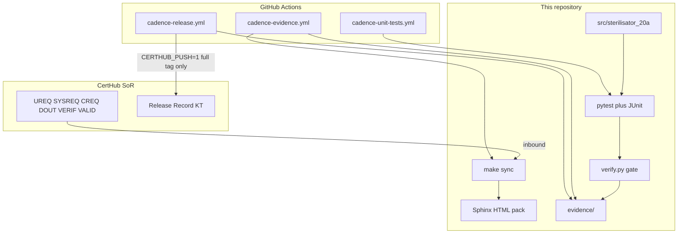

# Architecture

Cadence is the **engineering evidence twin** of a CertHub system of record.
Controlled requirements stay in CertHub. This repository syncs them, links them
to Sterilisator 20A source and tests, and on a full release tag writes one
Release Record back.



## Inbound (every `make sync` / PR evidence run)

1. Tech Doc KT metadata + seven Records lists + Tracer use-case edges
2. Sphinx-Needs RST under `sphinx/source/generated/` (gitignored)
3. No write to CertHub

## Engineering gate (`make show` / `make evidence`)

```text
SYSREQ → linked DOUT → CodeLinks on source → VERIF → JUnit certhub_test
```

The gate root is **System Requirements**. User / component / unit requirements
and VALID_* are synced for the catalog but do not close the gate.

## Outbound (full tag `vX.Y.Z` only)

`cadence-release.yml` builds the same evidence pack, uploads it as an artifact,
creates a GitHub Release, and POSTs one Release Record row (`CERTHUB_PUSH=1`).
RC tags (`v*-rc*`) stop at the artifact.

## Layout (connector vs product)

| Path | Role |
|------|------|
| `certhub/certhub_connector/` | Hand-written sync, verify, evidence, CLI |
| `certhub/certhub_connector/api/clients/` | Generated attrs HTTP clients — **public** (`x-public`) ops only; do not edit |
| `certhub/certhub_connector/api/api_models/` | Generated Pydantic models for Tech Doc / Records JSON validation |
| `certhub/certhub_connector/api/client.py` | Thin wrappers: attrs wire → Pydantic (or Tracer raw dict) |
| `src/sterilisator_20a/` | Example SaMD under test |
| `sphinx/source/` | Assurance pages + ubCode project |
| `.github/workflows/` | Unit tests, evidence, release |

Wire calls use attrs stubs from `openapi-python-client`. Domain code consumes
Pydantic from `datamodel-code-generator`. Wrappers never return attrs types.

## Related

- [Onboarding](onboarding.md)
- [Traceability map](traceability-map.md)
- [Regulatory gap analysis](regulatory-gap-analysis.md)
