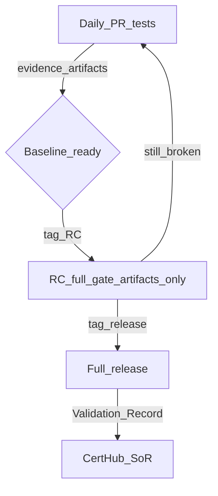
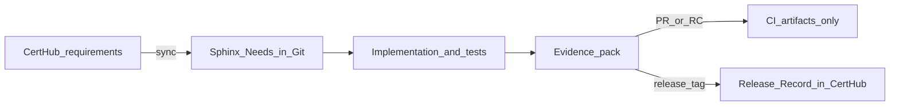

# Engineering proof is not a regulatory record

> Unpublished marketing draft. Not user documentation. Keep out of the README
> until it is edited and published elsewhere.

**How CertHub and a Sphinx-Needs evidence loop close the gap between Git and submission for SaMD teams**

**How CertHub and a Sphinx-Needs evidence loop close the gap between Git and submission for SaMD teams**

---

A developer merges a pull request and says the change “covers SYSREQ_002.” QA opens CertHub and looks for the chain. An auditor asks for the V-model link from approved requirement to design output to implementation to test result for a specific baseline. Three truths. Three systems. Rarely the same story.

That split is the quiet tax of SaMD development. Requirements live in the eQMS. Proof lives in Git. Someone eventually builds a matrix. The matrix drifts. Before audit, people rebuild it. Before release, people argue about which CI run “counts.” After release, people discover that either everything was filed as a compliance record (noise) or almost nothing was (gap).

The question underneath all of that is simple: **which runs belong in your head, and which belong in CertHub?**

This article answers that question from a CertHub customer’s point of view. It is a working model for teams that already keep requirements in CertHub, and for teams evaluating CertHub who want to know how engineering actually plugs in. The concrete loop uses Sphinx-Needs and the Useblocks toolchain (CodeLinks, Test-Reports) inside Git. CertHub remains the system of record. Your daily tests stay engineering proof. Only a deliberate full release writes a Release Record.

---

## The pain, from every seat

### Developers

You live in Git. Requirements live in a portal. Traceability arrives as homework after the feature is done: paste IDs into a spreadsheet, annotate a Confluence page, hope the IDs still match next quarter. The worse fear is the opposite extreme: if every green build becomes paperwork, you will stop running the gate that actually protects patients. Nobody wants a QMS that punishes continuous testing.

### QA and V&V

The tests exist. pytest is green. JUnit sits in an artifact. Linking those results to the *approved* requirement set in CertHub is still manual and brittle. You can prove the code behaved. You cannot always prove it behaved against the controlled baseline without a week of stitching.

### Regulatory and QMS

CertHub holds controlled content for a reason. What arrives from engineering is often a zip of screenshots, a slide deck, or a “trust us, CI was green” narrative. Or the opposite failure mode: thousands of noisy “records” from every pipeline on every branch, none of which an auditor wants to wade through. Controlled systems die from spam as surely as they die from emptiness.

### Leadership

IEC 62304 and MDR expect a maintained relationship between what you claimed, what you built, and what you verified. The organization runs two clocks: the sprint clock and the submission clock. When those clocks only meet in a war room two weeks before audit, you are not running a process. You are running a rescue.

### What usually fails

ReqIF exports that nobody re-imports cleanly. Spreadsheet matrices that are true on the day they are written. “Jira is our ALM” when Jira is actually a ticket inbox. Treating every merge to main as a V&V event. Treating release as the first day anyone looks at traceability. All of those are variants of the same mistake: confusing **engineering proof** with a **regulatory record**.

---

## The working model: daily, RC, release

This is the part that matters. Everything else in this article exists to make this model feel inevitable.

Most teams already know, informally, that not every test run belongs in the compliance file. The problem is that tooling and process rarely encode that knowledge. Either CI never talks to the eQMS, and someone copies artifacts by hand at the end, or CI talks too eagerly, and every branch build becomes a candidate “record.” The CertHub model encodes the informal truth as policy:

You run one gate. You write to CertHub once.

| Tier | What you do | What you get | CertHub write? |
|------|-------------|--------------|----------------|
| Daily / PR / main | Run tests, build an evidence pack | Local confidence + CI artifacts | No |
| Release candidate (`vX.Y.Z-rc.N`) | Same full gate as release | Dress rehearsal: artifacts prove the baseline is ready | No |
| Full release (`vX.Y.Z`) | Same gate again, then push | One Release Record for that baseline in CertHub | Yes |

**Engineering proof is continuous. Regulatory record is intentional.**

Read the table twice if you need to. The gate does not get weaker as you approach release. What changes is whether CertHub is asked to remember the run.

### Daily work: test constantly, file nothing

You run tests all day. That is healthy. Locally you open the gate and look at the dashboard. On a pull request you may build a full evidence pack: JUnit results, CodeLinks analysis, a verify status across every requirement, Sphinx HTML you can open in a browser. CI can upload that pack as an artifact. Stakeholders can download it. Engineers can fail the gate and fix the product before anyone talks about release.

None of that creates a Release Record in CertHub.

If every pipeline execution became a compliance row, CertHub would become a CI log with nicer fonts. Auditors do not want your Tuesday afternoon experiment. They want the controlled evidence for the baseline you claim to ship. Quality stays in control of when a baseline is “real.” Engineers keep their cadence. The gate still runs. The record waits.

This is also where fear dissolves for developers. Continuous testing is not a paperwork trap. You are allowed (expected) to prove the product fifty times a week without generating fifty regulatory events. CertHub is not watching every commit. It is waiting for the release you intend.

### Release candidates: dress rehearsal without the signature

When a version feels close, you tag a release candidate. Same evidence path as a real release: sync requirements from CertHub, run the full gate, upload artifacts. QA and regulatory can review the pack. You can fail honestly, fix, tag `rc.2`. You can show a dashboard that says BLOCKED without inventing a regulatory event you will later regret.

Still no Release Record in CertHub.

RC is where you learn whether the baseline is ready. It is not where you sign. Think of it as the last full dress rehearsal before opening night: same staging, same cues, same cast, no premiere. If your process today collapses “we think it works” and “we filed it in the eQMS” into the same click, you will either file too early or hesitate to cut candidates at all. Separate them, and RC becomes useful again.

For teams used to “we only run the real suite at the end,” this is the correction: run the real suite on the RC. Run it as hard as you will on release. Just do not pretend the rehearsal was the performance.

### Full release: the compliance moment

When you mean it, you tag a full release: `v1.0.0`. CI runs the same gate one more time. Then, and only then, it writes a Release Record into CertHub for that baseline: release number, commit, generation time, evidence pointer, status summary. One deliberate act. One controlled row in the system of record.

That is the moment CertHub covers. Not every test run. Not every merge. The release you chose. The requirements were already in CertHub. The evidence was already produced by your toolchain. The release is the handshake that turns engineering proof into a controlled Release Record.



### What you do not have to invent

You do not need a second, parallel ritual called “compliance theater.” Keep GitHub Actions, keep your Makefile or equivalent, keep Sphinx-Needs in the repo as the engineering twin of the requirements that already live in CertHub. A handful of commands maps to the whole model: sync requirements in, show or package evidence, tag an RC when you are rehearsing, tag a release when you are done. CertHub receives what auditors care about when you release on purpose, against requirements that were already controlled.

That is the reassurance, stated carefully: CertHub has the compliance write-back covered so your team can keep shipping. It does not replace engineering judgment. It does not pretend every green build is a medical device baseline. It integrates into the toolchain you already trust for software, and it refuses to confuse that toolchain with the QMS.

---

## How the loop works

Once the three tiers are clear, the mechanics are straightforward.



**Inbound.** CertHub holds the approved requirements and related verification and validation content. A sync step pulls that content into Sphinx-Needs in the repository: stable `SYSREQ_*`, `DOUT_*`, and `VERIF_*` identities that engineering can link from code and tests. The join is by Tracer use-case edges, not by list index. The living twin in Git stays honest to the controlled set in CertHub.

**Implementation and verification.** Source markers (`@need-ids` on specifications) and test markers (pytest properties mapped into JUnit) connect code and automated results to those identities. Useblocks CodeLinks and Test-Reports turn Git work into structured evidence instead of a narrative slide.

**The gate.** For each requirement: is there a linked specification, an implementation, a linked test, and a passing result? Aggregate status is VERIFIED or BLOCKED. Gaps are distinguishable: not implemented, implemented but not tested, tested but failed, verified. That is the stakeholder language of a V-model chain, produced from artifacts, not from memory.

**The surface.** The assurance view is Sphinx-Needs: tables, flows, charts. Not a custom audit SPA that becomes another product to validate. Download the evidence pack from CI and open the dashboard HTML. Same story locally and in the pipeline.

**Outbound.** Pull requests and release candidates upload the pack. Full release tags sync again, rebuild evidence, and POST the Release Record. The workflows refuse to treat RC tags or main-branch pushes as the compliance write. That refusal is a feature.

---

## A running example: Sterilisator 20A

We built a small SaMD to make the model concrete: Sterilisator 20A. It holds
sterilization temperature at 121°C ± 2°C, keeps cycle time within 60 minutes,
shows English operator UI labels, and fits a 50×40×35 cm footprint. Four
requirements. Enough to feel real. Small enough to follow end to end.

### Sync the controlled set into the repo

```bash
make sync
```

Requirements move from CertHub into Sphinx-Needs. The engineering twin now matches the system of record. You are not inventing IDs in the repo and hoping they reconcile later.

### Daily: prove, break, prove again

```bash
make show
```

Tests run. CodeLinks runs. The certification gate runs. The dashboard opens. Expect VERIFIED when the product is healthy.

Then break cycle-time reporting on purpose:

```bash
make break
make show
```

A test fails. The gate is BLOCKED. The dashboard still opens, so the failure is visible instead of hidden behind a quiet non-zero exit. Fix it:

```bash
make fix
make show
```

Back to green. At no point did CertHub receive a Release Record. You just did what good teams do every day: run the gate, fail honestly, repair the product.

What CI uploads on a pull request is the same gate without the browser:

```bash
make evidence
```

That writes an evidence pack (results, JUnit, Sphinx HTML, manifest). Artifact only. Still no CertHub write.

### Release candidate: full dress rehearsal

When the baseline feels ready, tag an RC:

```bash
make tag-rc VERSION=1.0.0 RC=1
```

CI runs the same path a release will run: sync, evidence, artifact upload. It stops before the CertHub write. QA can open the pack. Regulatory can look at the chain for `SYSREQ_001` through `SYSREQ_004` without anyone creating a row that pretends this candidate was the released device software. If the pack is wrong, you fix and tag another RC. CertHub stays clean. That is the point. You get the confidence of a full gate without the permanence of a compliance record.

### Full release: close the loop

```bash
make tag-release VERSION=1.0.0
```

The tag triggers the release pipeline: sync, evidence, artifact upload, then a push of the Release Record for baseline `1.0.0`. Commit identity, status, evidence pointer. The system of record now holds the intentional record for the baseline you claimed. Same gate the team used all week. Different consequence, because the tag said so.

If you only want to prove the API path without tagging a product release, a confirm round-trip exists for that. It is a technical proof, not a substitute for the release discipline above.

---

## What changes for a CertHub customer

**You can run tests all day** without turning CertHub into a CI log. Continuous assurance stops competing with controlled documentation.

**Release candidates become useful again.** Fail there. Re-prove there. Show the pack there. File nothing there.

**Release is the only moment compliance records are created** for this loop. Deliberate. Auditable. Tied to a baseline.

**Requirements stay controlled where they belong.** CertHub remains the source of truth. Git holds the twin and the proof, not a shadow requirements database that diverges for six months.

**Traceability is generated from real work.** Markers in code, results from tests, status from a gate. Not a matrix rebuilt the week before the auditor arrives.

**The toolchain stays yours.** A few commands and a few Actions jobs. Sphinx-Needs and Useblocks for the evidence layer. CertHub for the record. Integration, not a parallel religion.

---

## Who this is for

This model fits SaMD teams that take IEC 62304-style discipline seriously, keep or plan to keep requirements in CertHub, and have engineers who already live in Git. It fits organizations tired of choosing between “slow down every PR for paperwork” and “invent the evidence at the end.”

It is not for teams that want every pipeline run auto-filed as a Release Record. It is not a promise that a connector replaces engineering judgment, risk management, or clinical evaluation. The gate tells you whether the chain for these requirements is verified for this commit. Humans still decide when a baseline is the one you release.

---

## Closing

Everyday work produces engineering proof. Release candidates dress-rehearse a baseline with the same gate and none of the compliance write. Full release closes the loop: one Release Record in CertHub for the version you meant.

That boundary is the whole argument. Green CI is not a regulatory event. The eQMS is not a dump of every pipeline. CertHub holds the controlled requirements, and receives the intentional evidence when you ship. A few commands in your toolchain. The compliance moment covered when you release on purpose.

If you already use CertHub, this is the engineering loop we want you to recognize. If you are evaluating CertHub, this is how we think SaMD teams should connect Git to submission without lying to either side. The Cadence showcase behind this article walks the Sterilisator 20A through sync, green, red, evidence, RC, and release. The working model is the product. Cadence is proof that it runs.
